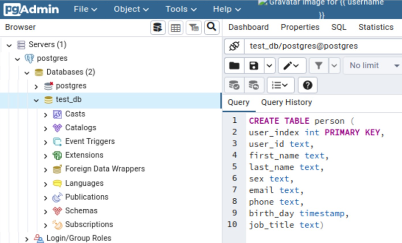
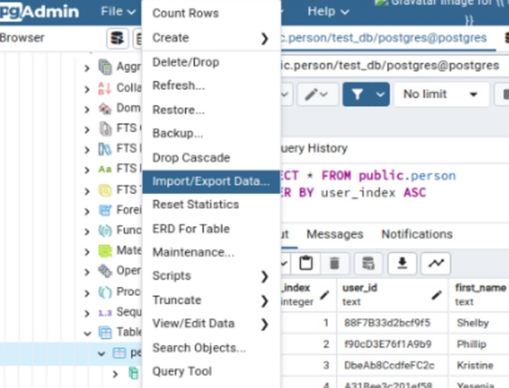
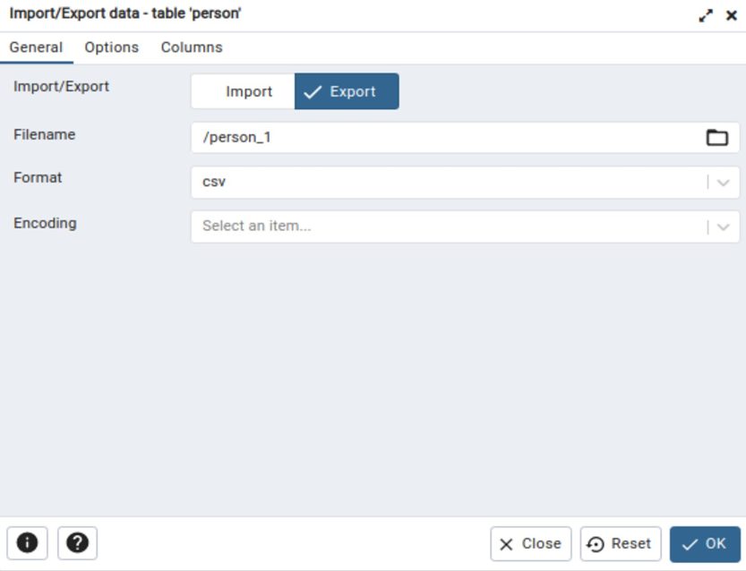
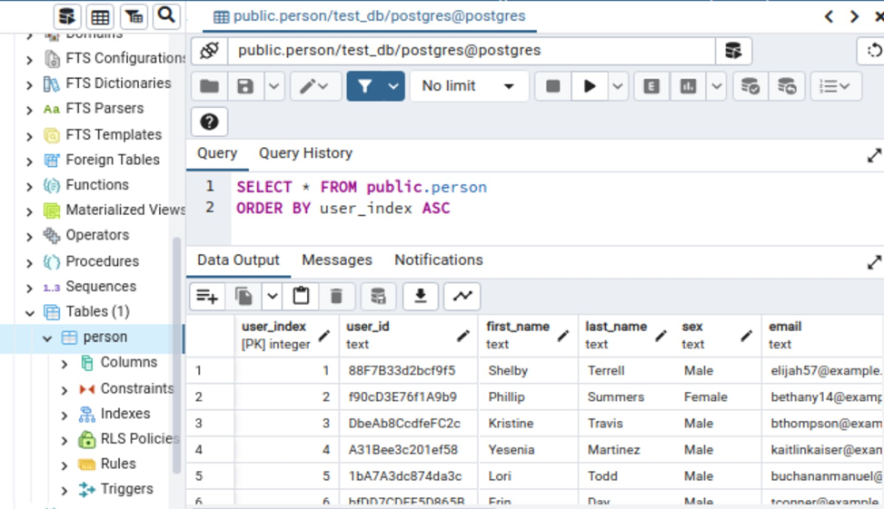
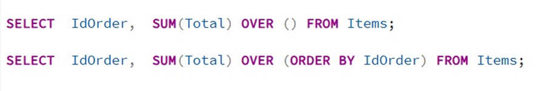
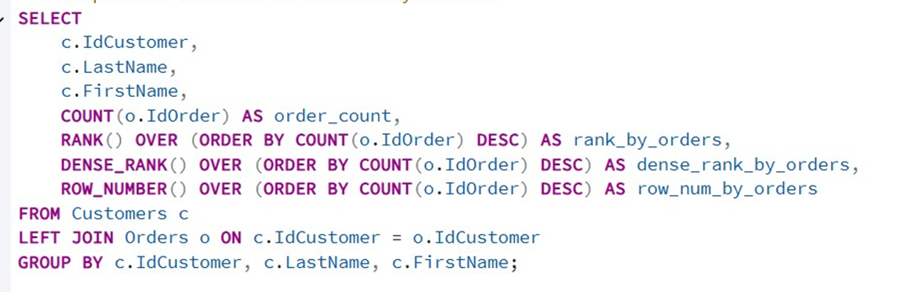
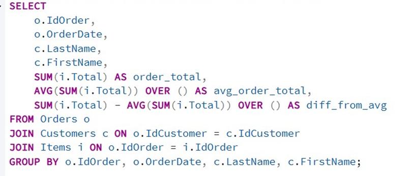
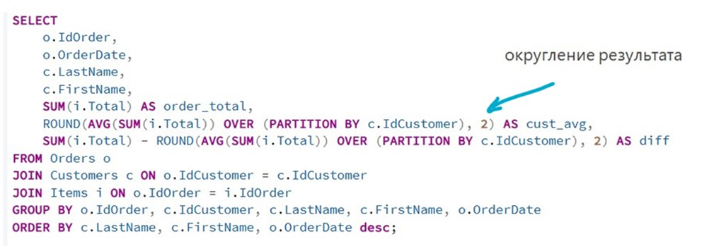
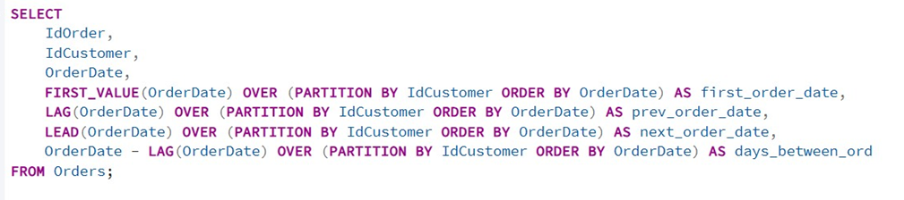

# Лабораторная работа №6. Экспорт и импорт данных, оконные функции

> **Цель работы**: Получить теоретические и практические навыки импорта и экспорта данных в PostgreSQL, а также работы с оконными функциями.

## Средства выполнения

* СУБД PostgreSQL
* Средство администрирования pgAdmin

## Пункты задания для выполнения

1. Изучить теоретические сведения лабораторной работы.
2. Выполнить импорт данных из csv-файла в БД (2-мя способами - с помощью sql-команды и с помощью графического интерфейса pgAdmin).
3. Выполнить экспорт данных из БД в csv-файл (2-мя способами - с помощью sql-команды и с помощью графического интерфейса pgAdmin).
4. Создать к базе данных SELECT .. OVER-запросы следующих видов:
    * запрос с ранжированием  (ROW_NUMBER, RANK, DENSE_RANK);
    * запрос с накопленными итогами  (SUM(), MAX());
    * запрос с анализом по группам (PARTITION BY);
    * запрос с использованием сравнения со смещением (LAG, LEAD).
5. Создайте новую базу данных с именем reservation_lab.
6. В этой базе данных создайте две таблицы:
    * products (id: целое число, первичный ключ, name: текст, stock: целое число)
    * reservations (id: целое число, первичный ключ, product_id: целое число, quantity: целое число, reserved_at: timestamp, try: короткое целое)
7. Заполните таблицу products несколькими тестовыми записями с различными остатками на складе.
8. Исследование транзакций с несколькими операциями SAVEPOINT:
    * напишите SQL-запросы, которые резервируют товар (в reservations записывается попытка резерва с флагом «0» в поле try, при наличии товара, уменьшает stock в products и добавляется запись с флагом «1» в reservations);
    * выполните эти запросы в одной транзакции, используя SAVEPOINT для сохранения промежуточного состояния после первой записи в  reservations;
    * после первой операции резервирования, выполните вторую операцию (с заведомо избыточным резервом), затем откатите изменения до SAVEPOINT с помощью ROLLBACK TO SAVEPOINT;
    * проверьте, что лог попытки резерва был сохранен, а изменения стока и сам резерв — отменены;
    * завершите транзакцию с помощью COMMIT. Проверьте, что первая операция осталась в базе данных, а вторая и третья — нет.
9. Блокировка данных:
    * откройте два сеанса подключения к базе данных;
    * в первом сеансе запустите транзакцию, которая блокирует продукт с id= 1 для записи (например, используя SELECT ... FOR UPDATE) и используйте функцию pg_sleep() для задержки;
    * во втором сеансе попробуйте выполнить запрос, который пытается обновить сток этого же продукта;
    * проверьте, что второй сеанс блокируется до завершения первой транзакции (COMMIT или ROLLBACK).
10. Защитить лабораторную работу.

## Теоретическая часть

### Экспорт данных в .csv-файл

Предположим, нам надо сохранить таблицу person в csv файл.



Создаем и заполняем таблицу.

Для получения .csv, в терминале выполним команду:

```sql
COPY person TO '/home/people_1.csv' DELIMITER ',' CSV HEADER;
```

(в случае ошибки «Permission denied», проверьте права файла, в который предполагается запись. Проверять во вкладке Security(Безопасность) свойств файла)

Существует и другой способ экспорта через pgAdmin: правой кнопкой мыши по нужной таблице – экспорт – указание параметров экспорта в открывшемся окне.





В обоих случаях, получаем файл с содержимым таблицы.

### Импорт данных из .csv-файла

Когда у вас есть необходимый .csv-файл, нужно определить какие в нем существуют колонки, далее создать новую базу данных или воспользоваться уже существующей. В данном случае была создана БД test_db. В БД создается таблица с полями, типы которых должны соответствовать «колонкам» .csv-файла.

Вводим команду на импорт данных из файла:

```sql
COPY person FROM '/home/people.csv' DELIMITER ',' CSV HEADER;
```

Примечание: если БД развернута в docker контейнере, то перед выполнением команды COPY необходимо скопировать файл csv в контейнер с помощью команды:

```bash
<docker cp /home/student/people.csv postgres:/home/>
```

Проверяем, что данные были загружены:



### Оконные функции

*Оконная функция* инструментов для аналитических запросов, выполняет вычисления для набора строк, некоторым образом связанных с текущей строкой, без сворачивания результатов в одну строку.

```sql
имя_функции ( * ) [ FILTER ( WHERE условие_фильтра ) ] OVER имя_окна
имя_функции ( * ) [ FILTER ( WHERE условие_фильтра ) ] OVER ( определение_окна )
```

Вызов оконной функции всегда содержит предложение OVER, следующее за названием и аргументами оконной функции. Это синтаксически отличает её от обычной или агрегатной функции. Предложение OVER определяет, как именно нужно разделить строки запроса для обработки оконной функцией. Предложение PARTITION BY, дополняющее OVER, указывает, что строки нужно разделить по группам или разделам, объединяя одинаковые значения выражений PARTITION BY. Оконная функция вычисляется по строкам, попадающим в один раздел с текущей строкой.

Для каждой строки существует набор строк в её разделе, называемый *рамкой окна*. Без ORDER BY рамка по умолчанию состоит из всех строк раздела. С указанием ORDER BY рамка состоит из всех строк от начала раздела до текущей строки и строк, равных текущей по значению выражения ORDER BY. Проверьте разницу результатов кода



### Основные оконные функции

**Ранжирующие функции:**

* `ROW_NUMBER()` — порядковый номер строки
* `RANK()` — ранжирование с пропусками
* `DENSE_RANK()` — ранжирование без пропусков
* `NTILE(n)` — разбивает результат на n групп

**Пример:**

Ранжирование клиентов по количеству заказов



**Агрегатные оконные функции:**

* `SUM()`, `AVG()`, `COUNT()`, `MIN()`, `MAX()`

**Пример:**

Сравнение суммы заказа со средним по всем заказам



Добавим инструкцию PARTITION BY - группирует строки запроса в разделы, которые затем обрабатываются оконной функцией независимо друг от друга, работает подобно предложению GROUP BY.

**Пример:**

Сравнение суммы заказа со средней суммы заказа клиента



**Функции смещения:**

* `LAG(column, offset)` — значение из предыдущей строки
* `LEAD(column, offset)` — значение из следующей строки
* `FIRST_VALUE(column)` — первое значение в окне
* `LAST_VALUE(column)` — последнее значение в окне

**Пример:**

Выведем даты первого заказа заказа клиента, предыдущего и последующего заказов и и перерыв между  текущим и предыдущим заказом.



## Контрольные вопросы

1. Что из себя представляет csv-файл?
2. Какой командой выполняется импорт csv-файла? Опишите структуру.
3. Для чего нужны оконные функции?
4. Назовите основные оконные функции. Пример.
5. В чем отличие оконных функций от агрегатных?
6. Что такое ранжирующие функции?
7. Что такое функции смещения?
8. Что такое рамка окна?
